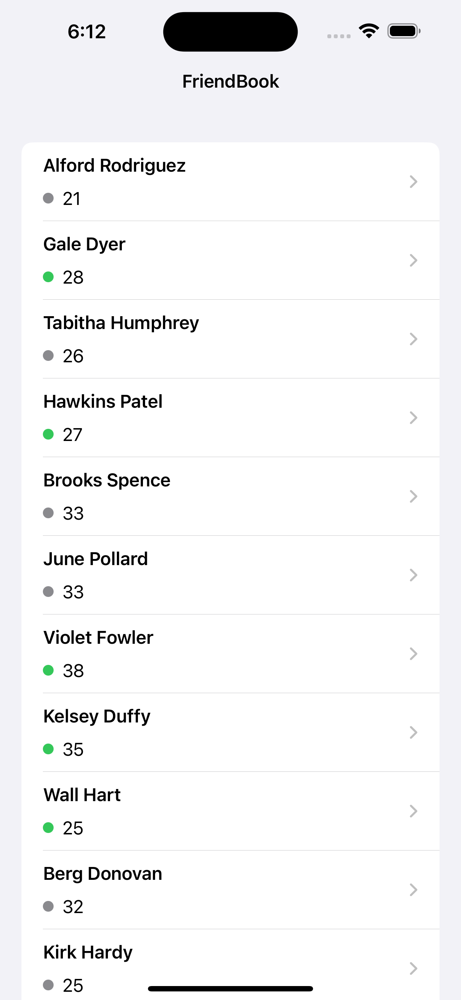
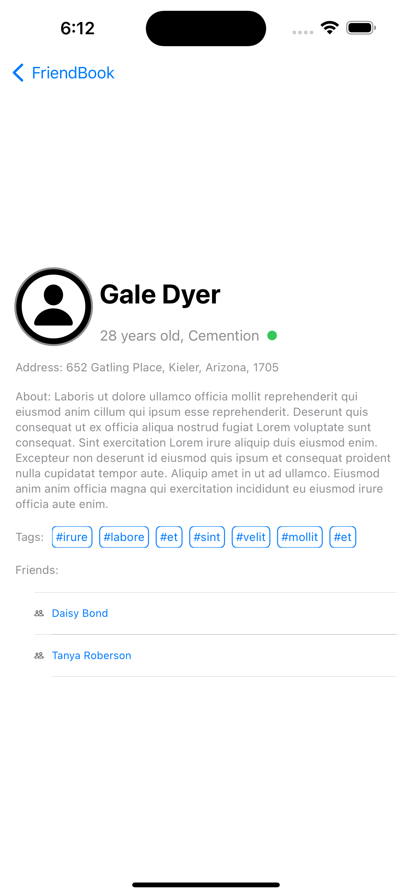

# FriendBook(FriendWise)

The solution to the [Challenge of 100 Days of SwiftUI](https://www.hackingwithswift.com/guide/ios-swiftui/5/3/challenge), which is designed to download user list over the Internet, then display the user profile detail in a separate user profile view.

## Screenshot

